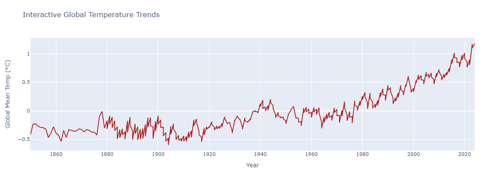

# Global Temperature Analysis: A Visualization of Climate Trends

This project analyzes global temperature trends using historical global temperature data from 1880 to the present. The goal of this project is to explore and visualize how the global mean temperature has changed over the years and to identify patterns such as accelerated warming.

## Project Overview

### Key Features:
- Line plot of global temperature trends from 1880 to the present.
- Heatmap visualization of global temperatures by month and year.
- Interactive temperature trend graph using Plotly.
- Insights into periods of accelerated warming.

### Dataset:
The dataset used in this project is publicly available from [Global Temperature Data](https://datahub.io/core/global-temp). It contains annual temperature records with columns for the year and the mean global temperature.

### Requirements:
- pandas
- matplotlib
- seaborn
- plotly

Note!
This project includes an analysis of global temperature trends with an interactive plot.

## Screenshot of the interactive plot



The plot above visualizes the temperature data. To interact with the plot, run the code locally.

To install the required libraries, you can run:
```bash
pip install -r requirements.txt
